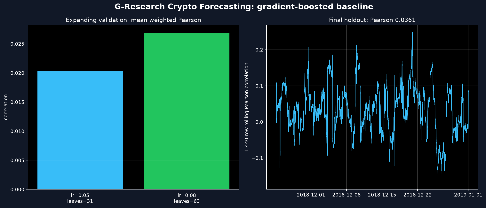

# G-Research Crypto Forecasting Baseline

An end-to-end, leakage-aware research baseline for a public mirror of Kaggle's
G-Research Crypto Forecasting data. The project trains a histogram gradient
boosting model on minute-bar features, selects its configuration using
expanding chronological folds, and evaluates a later embargoed holdout.

## Verified Result

The checked run uses a 2018 Cardano-only slice with 372,665 rows.

| Metric | Result |
| --- | ---: |
| Mean three-fold validation weighted Pearson | `0.02690` |
| Final retrospective holdout weighted Pearson | `0.03611` |
| Matched-coverage one-minute-return baseline | `-0.00913` |
| Final holdout rows scored | `55,884` |

The holdout result is labelled retrospective because an earlier exploratory
version inspected that period. Configuration selection in the checked version
uses only the three expanding validation folds.



## Method

- **Features**: lagged returns over 1/5/15/30/60 minutes, 15- and 60-row
  volatility, relative volume, candle shape, VWAP gap, and cyclical time
  features.
- **Point-in-time safety**: features only use the current completed candle and
  prior observations. Return features are invalidated whenever a source gap
  breaks the requested calendar-time lag.
- **Validation**: three expanding windows select between two gradient-boosting
  configurations. A 16-minute calendar embargo separates every training,
  validation, and holdout boundary to account for the forward-looking target.
- **Metric**: strict weighted Pearson correlation. Every model and baseline is
  scored on the same rows; invalid predictions or non-positive weights fail the
  run rather than being silently omitted.
- **Artifacts**: the run saves selection scores, a trained model, final
  metrics, source SHA-256, package versions, a prediction sample, and a visual
  report under `outputs/`.

## Run It

```bash
python3.13 -m venv .venv
.venv/bin/pip install -r requirements.txt
.venv/bin/python download_data.py
.venv/bin/python -m unittest discover -s tests -v
.venv/bin/python advanced_solution.py
```

## Data and Scope

The script downloads `full_data__3__2018.csv` from the public Kaggle archive
`yamqwe/cryptocurrency-extra-data-cardano`. This is not the complete original
competition training set: it contains one asset and does not populate the
original competition weights. The code therefore evaluates with equal weights,
which is clearly recorded in `outputs/metrics.json`.

This is research code, not a live trading system. The next credible step is to
run the same pipeline on an untouched later period and the original multi-asset
data before making any performance claim.
