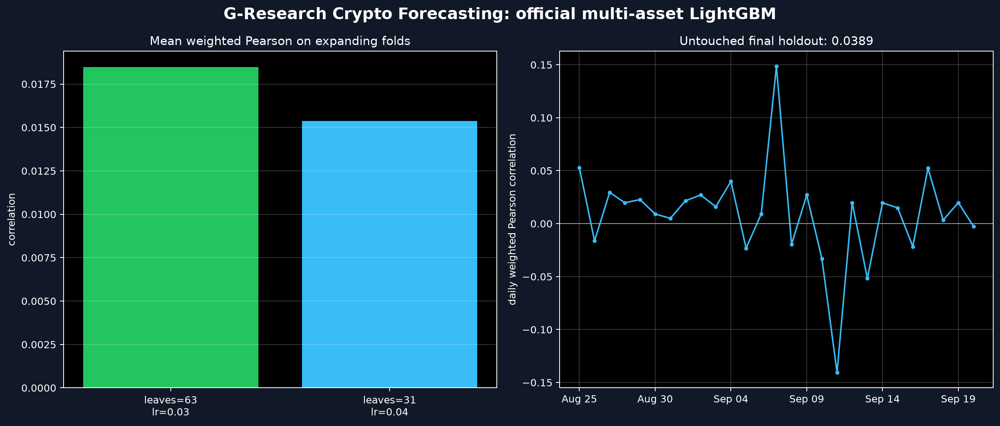

# G-Research Crypto Forecasting

This is a reproducible research baseline for Kaggle's **G-Research Crypto
Forecasting** competition. It predicts the supplied short-horizon crypto target
from completed one-minute candles. It is a learning project and historical
backtest, not a live trading system or evidence of a tradeable strategy.

The main pipeline uses the original 14-asset training archive and its official
asset weights. An earlier Cardano-only public mirror baseline remains in
`advanced_solution.py` as a smaller smoke test; do not compare its equal-weight
score directly with the official multi-asset result.

## Checked Official Run

The current checked run extracts the final 180 calendar days from the original
archive, then keeps the latest 15% of timestamps as an untouched holdout.

| Item | Checked value |
| --- | ---: |
| Original source rows in prepared window | `3,627,788` |
| Assets | `14` |
| Development rows | `3,081,619` |
| Final holdout rows | `543,876` |
| Embargo between partitions | `16 minutes` |
| Mean weighted Pearson during selection | `0.01848` |
| Final holdout weighted Pearson | `0.03895` |
| Naive one-minute-return holdout score | `-0.00787` |



### Reading the Report

The left bars compare candidate models on two **expanding validation folds**:
each later fold trains on all prior data, then predicts a future block. Higher
weighted Pearson means the model's predictions and target moved together more
often after applying the competition's asset importance weights. The bars are
small because correlation is a hard metric, not a percentage of correct trades.

The right chart gives one weighted Pearson score for each calendar day in the
final holdout. The horizontal zero line separates days where the ranking moved
with the target from days where it moved against it. Variation above and below
zero is expected in noisy financial data. The overall score is calculated from
all holdout rows, so this chart is useful for judging stability, not for
cherry-picking its best day.

## Why the Validation Is Time-Aware

The target in this competition incorporates future movement. A random train/test
split would mix near-neighbour minutes across train and test and make the model
look stronger than it really is. This project instead uses:

- **Expanding folds**: train on the past and validate on a later period.
- **A 16-minute embargo**: leave a gap at every boundary so a target's
  forward-looking window cannot spill into the other partition.
- **Strict weighted Pearson**: every target, prediction, and official weight
  must be finite; the script fails instead of quietly dropping invalid rows.
- **Matched baseline coverage**: the naive one-minute return is zero where a
  true one-minute lag is unavailable, rather than deleting difficult rows.

## Features

All features are available after the current one-minute candle has closed:

- 1/5/15/60 minute returns, rolling volatility, and relative volume per asset.
- Candle shape: open-to-close move, high-low range, and close-to-VWAP gap.
- Cross-market context: weighted market returns, market breadth, and an
  asset's return relative to the market move.
- Cyclical minute-of-day and day-of-week encodings.

The gradient-boosting model is LightGBM. Its two configurations are selected by
the chronological folds only; the later final holdout is never used to choose a
candidate.

## Reproduce the Official Pipeline

You need a Kaggle token with access to the public archive. The `orig_train.jay`
file is large, so expect the initial download and extraction to take time and
disk space.

```bash
# Main model environment (Python 3.13 was used for the checked run)
python3.13 -m venv .venv
.venv/bin/pip install -r requirements.txt

# macOS requirement for LightGBM's OpenMP runtime
brew install libomp

# Separate Python 3.11 environment for the JAY reader
python3.11 -m venv .jay-venv
.jay-venv/bin/pip install -r requirements-ingest.txt

# Download the original archive files and prepare a reproducible 180-day window
.venv/bin/python download_official_data.py
.jay-venv/bin/python prepare_official_data.py --days 180

# Check metrics and fit the official multi-asset model
.venv/bin/python -m unittest discover -s tests -v
.venv/bin/python official_solution.py
```

The preparation step writes `data/official/train_last_180_days.manifest.json`
with input SHA-256 hashes, time range, row count, and asset names. The model
writes selection scores, final metrics, per-asset holdout scores, a LightGBM
model file, a prediction sample, and the report image under `outputs/`.

## Data Source and Scope

`download_official_data.py` fetches archive version 35 of
`yamqwe/cryptocurrency-extra-data-cardano`. Despite that archive name, the
files used by the official pipeline are the original G-Research competition
artifacts: `orig_train.jay`, `orig_asset_details.jay`, and the example test and
submission files. The pipeline does not mix these with reconstructed Cardano
CSV target data.

This work does not include transaction costs, execution latency, position
sizing, a live data feed, or post-competition market testing. Those are
separate problems that must be solved before treating a forecasting signal as a
trading strategy.
